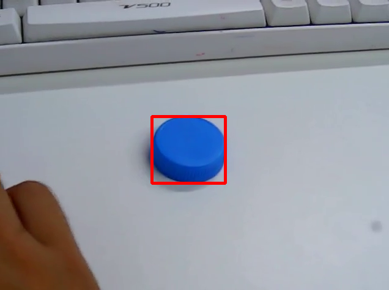
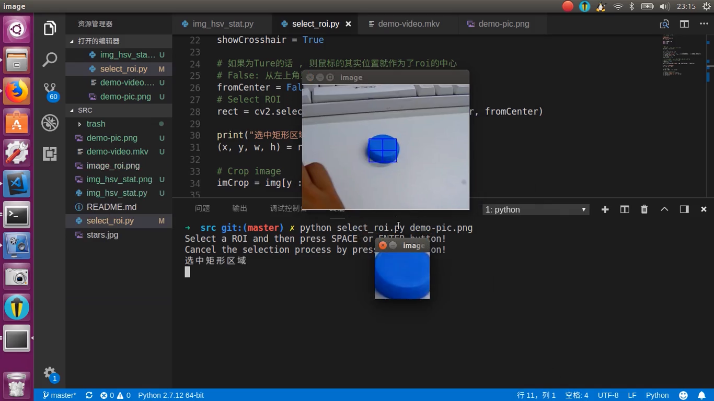
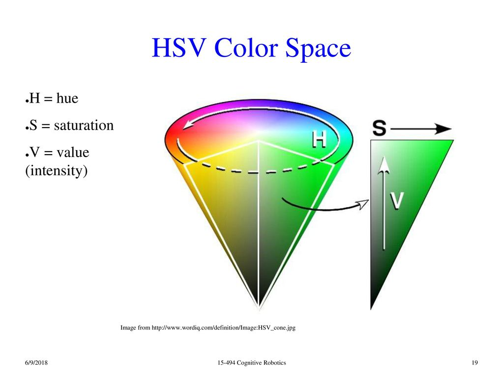
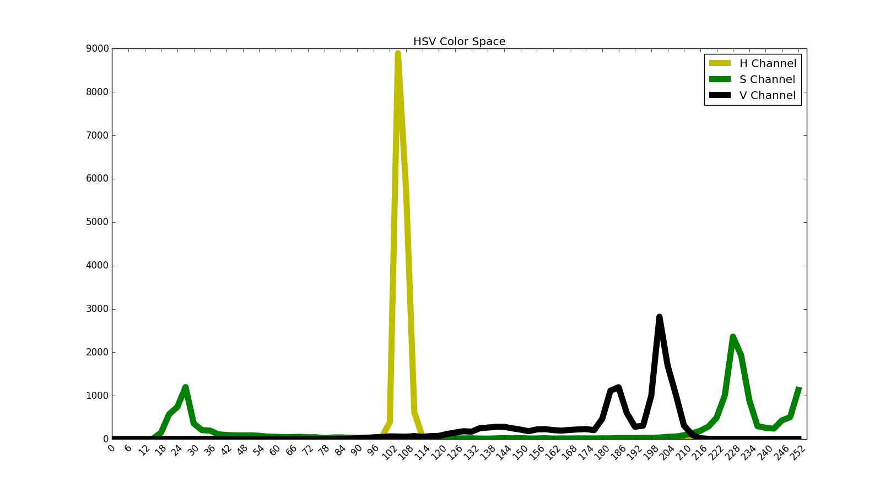
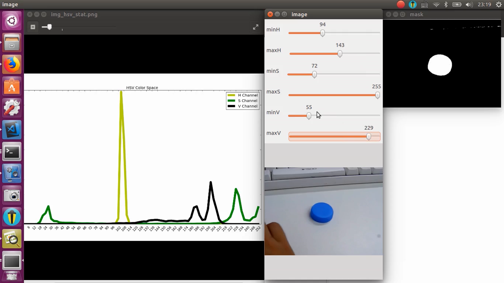

# OpenCV色块识别-1Z实验室

作者: 阿凯
出品: 1Z实验室(1zlab) **Make Things Easy**

## 前言

在OpenCV上实现颜色识别是很多人入门计算机视觉(OpenCV)首先会去学习的算法.



而且颜色识别可以广泛应用于色块追踪, 巡线等机器人项目.   
为了方便大家入门OpenCV以及使用OpenCV实现颜色识别, 阿凯编写了相关的**上位机脚本**, 同时也有. 刚开始的时候, 你的精力可以放在算法流程上面, 没必要在前期过于关注代码的细节. 脚本的代码阿凯也是**逐行注释**的, 也可以作为你的项目参考 .


> 备注: 代码兼容Windows, Mac, Ubuntu

## 目录

* [步骤1-选择ROI区域](#1选择ROI区域)
* [步骤2 - 图像颜色统计HSV](#2图像颜色统计HSV)
* [步骤3-颜色阈值动态调节](#3颜色阈值动态调节)
* [步骤4-色块识别](#4色块识别)


## 1选择ROI区域

桌面上放置着一个瓶盖, 如果我们想识别蓝色瓶盖的话, 第一步就需要截取蓝色瓶盖的蓝色区域的子图(**ROI, Region Of Interest, 感兴趣区域**).

选择ROI区域代码在`01-选择ROI区域`文件夹下.    代码演示视频见: `01-选择ROI区域/演示视频`


```bash
python select_roi.py "图片文件路径"
```

例如:

```bash
python select_roi.py demo-pic.png
```



截取出来的图像就是这样的.


## 2图像颜色统计HSV

获取了瓶盖的子图之后, 我们就要对图片在**HSV颜色空间(color space)**下的统计进行可视化的绘制, 从而**获取颜色阈值的初步参考范围**.




图像颜色统计HSV在`02-图像颜色统计HSV`文件夹下.    代码演示视频见: `02-图像颜色统计HSV/演示视频`


**脚本使用方法**

```bash
 python img_hsv_stat.py  <图片路径>
```

应用举例.

```bash
 python img_hsv_stat.py image_roi.png
```




观察上面的统计图,我们可以获取到`蓝色瓶盖`在HSV颜色空间下的分布.


| 通道(Channel)        | 最小值(Min) | 最大值(Max) |
| -------------------- | ----------- | ----------- |
| H: Hue  色调/色彩    | 96          | 114         |
| S: Saturation 饱和度 | 210         | 255         |
| V: Value  明暗       | 174         | 216         |


## 3颜色阈值动态调节


有了大致的颜色范围还不行,  我们需要借助**颜色阈值调节工具**去细化, 对阈值进行微调. 阈值的初始设定,按照之前获取的大致范围开始.然后按照阈值进行图像**二值化(binary)**, 满足阈值条件的像素点为白色, 不满足阈值条件的像素为黑色.


HSV颜色阈值动态调节工具 在`03-HSV颜色阈值动态调节工具 `文件夹下.    代码演示视频见: `03-HSV颜色阈值动态调节工具 /演示视频`




**脚本使用说明**

```bash
python ThresholdEditorGUIHsv.py + <图片路径>
```

例如:

```bash
python ThresholdEditorGUIHsv.py demo-pic.png
```


**阈值调节目标**

调节目标,就是要让**目标颜色区域变为白色.** 


选中窗口,按`E`键盘退出程序.


## 4色块识别

获取到颜色阈值了,我们就可以检索画面中的色块啦. 

色块识别 在`04-色块识别 `文件夹下.    代码演示视频见: `04-色块识别 /演示视频`


**脚本使用方法**

运行测试程序`test_color_feature.py`

```
python test_color_feature.py
```

默认是从视频中读入视频流, 并显示识别后的视频.

如果是从图片中读入的话就调整一下代码注释:

```python
if __name__ == "__main__":
    # 测试图片色块识别
    test_color_block_finder_01()
    # 测试视频流色块识别
    # test_color_block_finder_02()
```


色块识别的核心算法已经封装在`color_block_finder.py` 里面的`color_block_finder` 函数中, 函数返回的是Tuple类型的矩形区域. 通过`draw_color_block_rect` 函数可以绘制画面中的色块.


颜色阈值如果要调整的话, 调整这里:

* `lowerb = (minH, minS, minV)`
* `upperb = (maxH, maxS, maxV)`

```python
def test_color_block_finder_02():
    '''
    色块识别测试样例2 从视频流中读取并且识别
    '''
    # 视频路径
    video_path = 'demo-video.mkv'
    # 颜色阈值下界(HSV) lower boudnary
    lowerb = (96, 210, 85) 
    # 颜色阈值上界(HSV) upper boundary
    upperb = (114, 255, 231)
```

